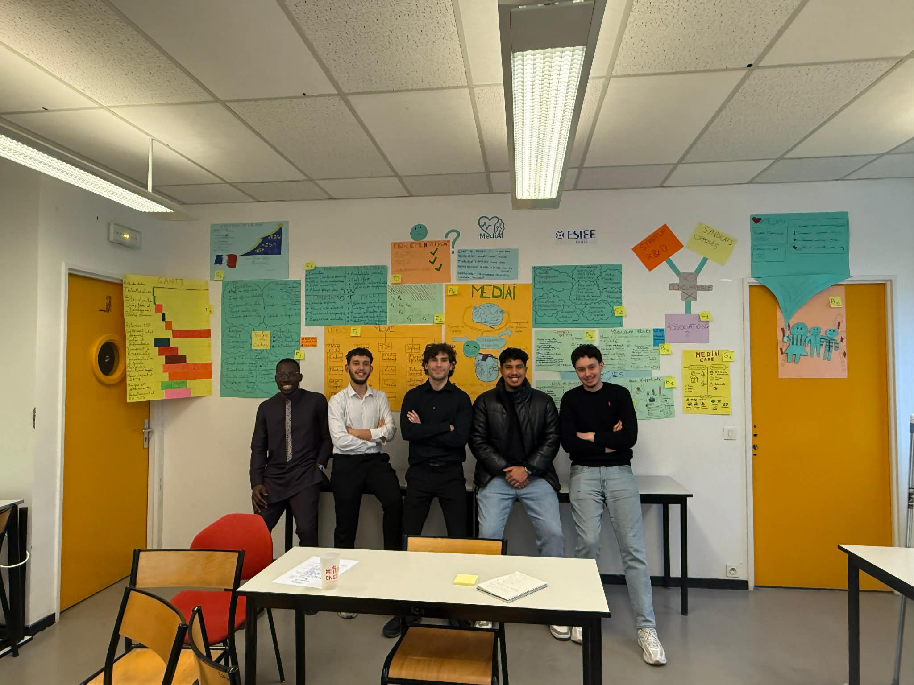
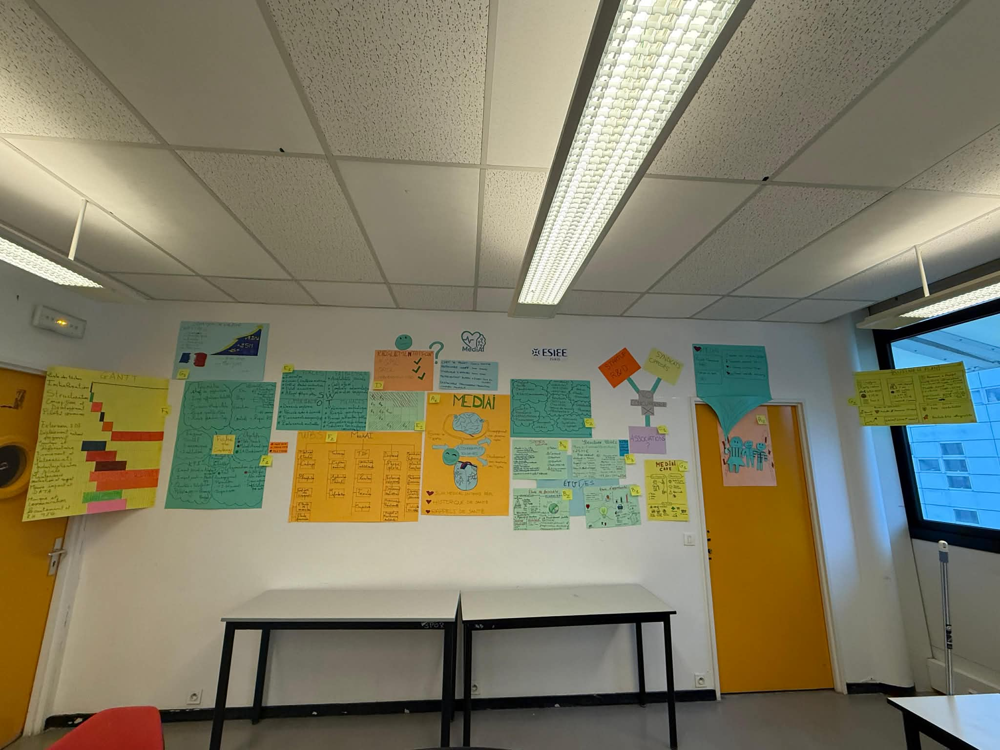

# 🏥 Projet MediAI Care — Dispositif Connecté d'Assistance Médicamenteuse

Projet réalisé en équipe de 5 dans le cadre du module **Gestion de Projet** à l'ESIEE Paris (Janvier 2026).

## 📋 Description du projet

MediAI Care est un **pilulier connecté intelligent** conçu pour assister les personnes âgées et les personnes en situation de réinsertion sociale dans la prise régulière de leurs médicaments.

Le dispositif combine un capteur physique de détection d'ouverture du pilulier avec une interface numérique de suivi, permettant d'alerter un proche ou un professionnel de santé en cas d'oubli. Le projet s'inscrit dans une logique de **bien vieillir à domicile** et de **prévention des risques médicaux**.

L'objectif du module était de mener ce projet de A à Z comme le ferait une équipe projet en entreprise : du cadrage initial jusqu'au business plan et au déploiement logistique.

## 🗂️ Livrables produits

| Document | Contenu |
|---|---|
| **Fiche de cadrage** | Définition du périmètre, objectifs, contraintes et jalons |
| **WBS** | Décomposition structurée de l'ensemble des tâches du projet |
| **Diagramme de Gantt** | Planification temporelle avec identification du chemin critique |
| **Analyse PERT** | Estimation des durées et optimisation du planning |
| **Analyse des risques (AMDEC)** | Identification, cotation et plan de mitigation des risques |
| **Étude de faisabilité** | Analyse technique et opérationnelle du dispositif |
| **Étude d'opportunités** | Analyse de marché, concurrence et positionnement |
| **Parties prenantes** | Cartographie complète : syndicats, associations, hôpitaux, mutuelles... |
| **Structure des coûts** | Décomposition détaillée des coûts de production et de déploiement |
| **Analyse de rentabilité** | Calcul du ROI, seuil de rentabilité et projections financières |
| **Business Plan** | Modèle économique complet et stratégie de commercialisation |
| **RoadMap** | Planning de déploiement par phases |
| **Demande de remboursement** | Dossier médical pour prise en charge par les mutuelles |

## ⚙️ Compétences mobilisées

- **Gestion de projet** : WBS, Gantt, PERT, chemin critique
- **Analyse des risques** : AMDEC (cotation gravité × occurrence × détection)
- **Analyse financière** : structure des coûts, calcul de rentabilité, business model
- **Gestion des parties prenantes** : cartographie, analyse des influences et intérêts
- **Étude de marché** : analyse concurrentielle, étude d'opportunités
- **Planification logistique** : roadmap de déploiement, chaîne d'approvisionnement
- **Travail en équipe** : coordination sur 5 membres, répartition des tâches, compte-rendus de séances

## 👥 Équipe

Projet réalisé en équipe de 5 — ESIEE Paris
